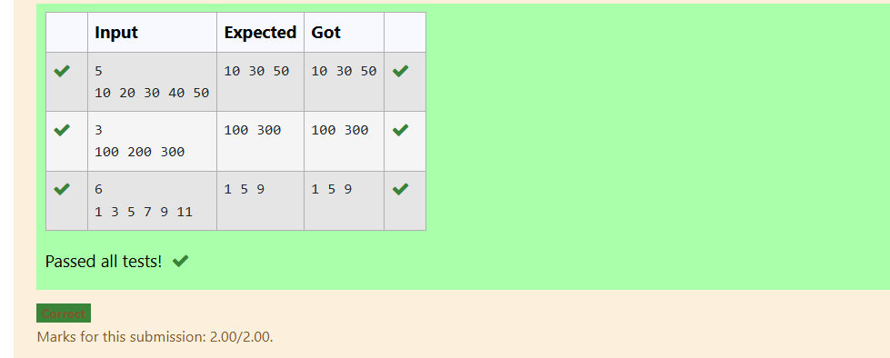

# EX-11-EMI-CALCULATOR

## AIM

To write a program to prepare EMI calculator using function without return type and with arguments.

## ALGORITHM

1. Start the program.

2. Read the principal amount a, rate of interest r, and time in years t.

3. Calculate total number of months: n = t * 12.

4. Calculate monthly interest rate: i = r / (12 * 100).

5. Compute EMI using formula:
  e=a*i*((1+i)^n)/((1+i)^n)-1
6. Print the monthly EMI value.

7. Stop the program.

## PROGRAM
```
#include <stdio.h>
#include <math.h>
void emi();
int main()
{
    emi();
    
}

void emi()
{
    float a,r,t,e,n,i;
    scanf("%f %f %f ",&a,&r,&t);
    n=t*12;
    i=r/(12*100.0);
    e=(a*i*pow(1+i,n))/(pow(1+i,n)-1);
    printf("Monthly EMI is= %.3f",e);
}
```

## OUTPUT


## RESULT

Thus the program to prepare EMI calculator using function without return type with arguments has been executed successfully
 
 


# EX-12-FIBONACCI-SERIES
## AIM
Create a C program  to generate the Fibonacci series for 8 using do-while loop.

## ALGORITHM
1.	Start the program.

2. Read the number of terms n from the user.

3. Initialize first two terms: t1 = 0, t2 = 1, and counter i = 1.

4. Use do-while loop to:

  * Print the current term t1.

  * Calculate the next term next = t1 + t2.

  * Update t1 = t2 and t2 = next.

  * Increment i by 1.

5. Repeat the loop until i <= n.

6. Stop the program.
## PROGRAM
```
#include <stdio.h>

int main() {
    int n, t1 = 0, t2 = 1, next, i;

    scanf("%d", &n);


    for (i = 1; i <= n; i++) {
        printf("%d ", t1);
        next = t1 + t2;
        t1 = t2;
        t2 = next;
    }

    printf("\n");
    return 0;
}

```
## OUTPUT


## RESULT
Thus, the program to generate the Fibonacci series for 8 terms using a do-while loop has been executed successfully
 


# EX-13-ONE-DIMENSIONAL-ARRAY
## AIM
Create  a C program to read n elements as input and print the elements of an array present on odd position

## ALGORITHM
1. Start the program.

2. Read the number of elements n from the user.

3. Read n elements and store them in the array a.

4. Use a loop to print the elements present at even index positions (i = 0, 2, 4, …).

5. Stop the program.
## PROGRAM
```#include <stdio.h>

int main()
{
    int n, i;
    scanf("%d",&n);
    int a[n];
    for(i=0;i<n;i++)
    {
        scanf("%d",&a[i]);
}
    for(i=0;i<n;i=i+2)  
    {
        printf("%d ",a[i]);
}
    return 0;
}
```

## OUTPUT



## RESULT
Thus, the program to read n elements as input and print the elements at even index positions has been executed successfully.
 
 


# EX-14-POSITIVE-ARRAY-ELEMENTS
## AIM
To Write a C Program to Print the sum of an Array

## ALGORITHM
1.	Start the program.

2. Initialize variables n = 0 and sum = 0.

3. Read numbers continuously using while (scanf("%d", &a[n]) == 1) until input ends.

4. Add each entered number to sum and increment n by 1.

5. After input ends, display the total sum of all entered numbers.
## PROGRAM
``` 
#include <stdio.h>

int main() {
    int a[100], n = 0, sum = 0;

   
    while (scanf("%d", &a[n]) == 1) {
        sum += a[n];
        n++;
    }

    printf("Total Sum: %d\n", sum);

    return 0;
}
```

## OUTPUT


## RESULT

Thus, the program to read numbers continuously and print the total sum of all entered numbers has been executed successfully.

# EX -15 - Replace All Even Elements With 'E' In One Dimensional Array

## Aim:
To write a C program to replace all even elements with 'E' in one dimensional array

## Algorithm:
1.	Start the program.

2. Declare an integer variable n to store the number of elements.

3. Read the value of n from the user.

4. Declare an integer array a[n] to store the elements.

5. se a for loop to read all n elements into the array.

6. During each iteration, check whether the element is even or odd.

7. If the element is even, print E; otherwise, print the element itself.

8. Stop the program.

## Program:
```
#include <stdio.h>
int main()
{
    int n;
    scanf("%d",&n);
    int a[n];
    for(int i=0;i<n;i++)
    {
        scanf("%d",&a[i]);
        if(a[i]%2==0)
        printf("E ");
        else
        printf("%d ",a[i]);
    }
}
```
## Output:
 


## Result:

Thus, the program to replace all even elements with 'E' in one dimensional array was verified successfully.


